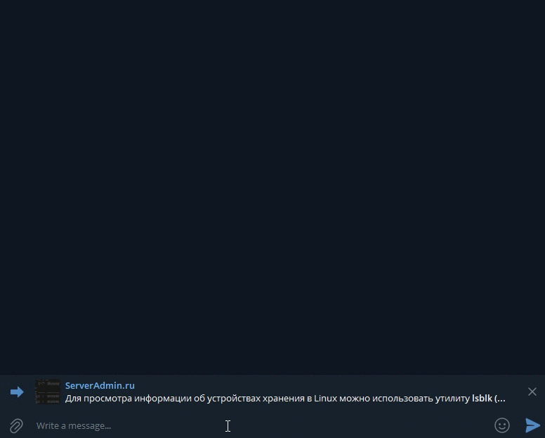
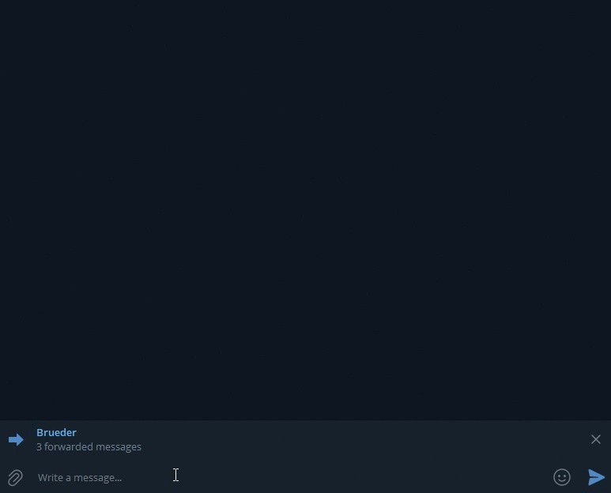
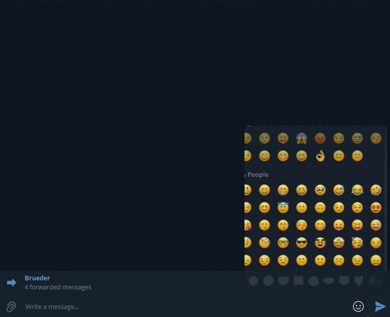

# Downloader Telegram Bot
This project should be deployed on your personal file server. It serves as a service for downloading posts from telegram.
Just send one or more messages to the bot so that the bot remembers them.

## Commands
```
/download [method]
```
You can download the message pool using the specified method (post, media, text).

Arguments:
  - --standart-dir (-s) - Uploading to a standard directory
  - --dir (-d) [directory] - Uploading to the selected directory
  - --mkdir - Helps the --dir argument to create a directory

*The arguments --dir and --standart-dir cannot be in the same line*

```
/pool
```
Working with the message pool. Without arguments shows how many messages are in pool

Arguments:
- --delete - Clears the message pool

## Usage examples
### **If you liked some post, then just download it!**

### **You can't not download all the pictures with cats!**

### **There is useful information in the correspondence that is worth saving**


## How to launch
Change ./docker-compose.yml. Here you need add download volume
```
services:
  backend:
    restart: always
    build: ./TelegramBotDownloader
    volumes:
     - YOUR_VOLUME:/app/mnt:rw
```
Change ./TelegramBotDownloader.UI/appsetting.json. Here you need add your bot's token
```
"Options": {
  "DownloadFolder": "/app/mnt",
  "TelegramToken": "YOUR_TOKEN"
}
```
After changing the files, enter
```
docker-compose up -d
```